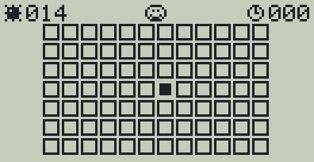
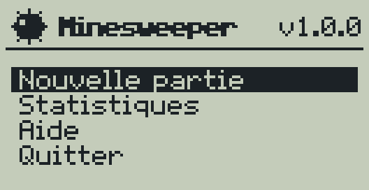
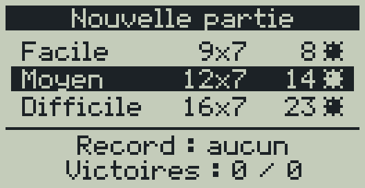
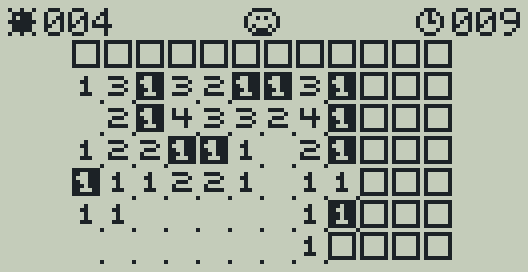
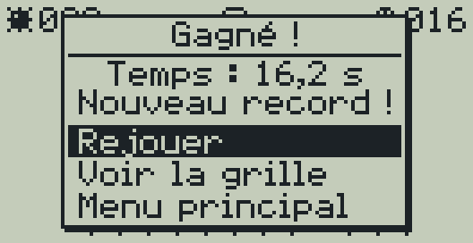
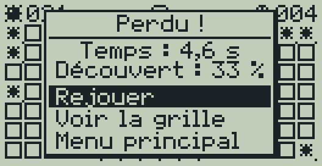
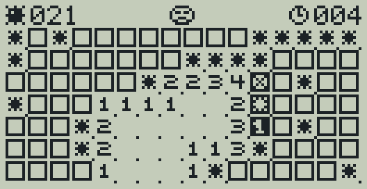
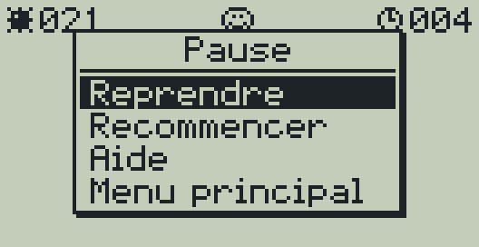
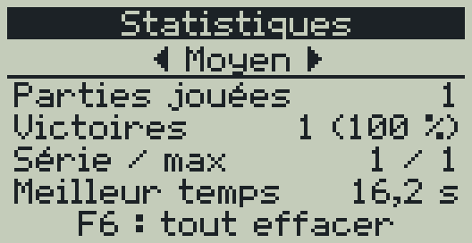
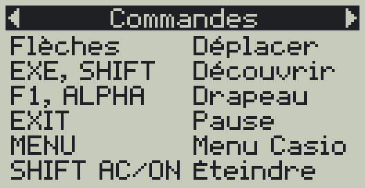

# Minesweeper pour Casio fx-9750GIII

[](https://github.com/boloru78/minesweeper-for-casio-fx-9750Giii/actions/workflows/build.yml)
[](LICENSE)


Un démineur complet pour la calculatrice graphique **Casio fx-9750GIII**,
écrit en C avec [gint](https://git.planet-casio.com/Lephenixnoir/gint) et le
[fxSDK](https://git.planet-casio.com/Lephenixnoir/fxsdk). Il s'installe comme
une application (add-in `.g1a`) dans le menu principal de la calculatrice :
rapide, fluide, avec sauvegarde des records et reprise des parties.

<p align="center">
  
</p>

## Sommaire

- [Fonctionnalités](#fonctionnalités)
- [Captures d'écran](#captures-décran)
- [Installation](#installation)
- [Comment jouer](#comment-jouer)
- [Sauvegarde](#sauvegarde)
- [Compiler le jeu soi-même](#compiler-le-jeu-soi-même)
- [Organisation du code](#organisation-du-code)
- [Outils de développement](#outils-de-développement)
- [Publier une nouvelle version](#publier-une-nouvelle-version)
- [Questions fréquentes](#questions-fréquentes)
- [Idées pour la suite](#idées-pour-la-suite)
- [Contribuer](#contribuer)
- [Crédits et licence](#crédits-et-licence)

## Fonctionnalités

- **Trois niveaux** pensés pour l'écran de 128×64 pixels, sans défilement :

  | Niveau | Grille | Mines | Densité |
  | --- | --- | --- | --- |
  | Facile | 9 × 7 | 8 | 13 % |
  | Moyen | 12 × 7 | 14 | 17 % |
  | Difficile | 16 × 7 | 23 | 21 % |

- **Premier coup toujours sûr** : la case choisie et ses 8 voisines ne cachent
  jamais de mine, donc le premier coup ouvre toujours une zone.
- **Découverte en cascade** des zones vides, **drapeaux**, **compteur de
  mines** restantes, **chronomètre** au dixième de seconde et visage qui
  réagit (lunettes de soleil en cas de victoire).
- **Meilleur temps et statistiques** par niveau : parties jouées, victoires,
  pourcentage, série en cours et meilleure série.
- **Pause** (la grille est cachée pendant que le chronomètre est arrêté) et
  **reprise de partie** : après la touche MENU, après une extinction, ou au
  lancement suivant si une autre application a été ouverte entre-temps.
- **Aide intégrée** : règles, commandes, astuces.
- **Extinction automatique** après 10 minutes sans appui, partie sauvegardée.
- Interface **entièrement en français**, avec une police dessinée pour le jeu
  qui affiche les accents.

## Captures d'écran

| Menu principal | Choix du niveau | Partie en cours |
| :---: | :---: | :---: |
|  |  |  |
| **Victoire** | **Défaite** | **Grille après une défaite** |
|  |  |  |
| **Pause** | **Statistiques** | **Aide** |
|  |  |  |

Ces images sont produites automatiquement par le
[simulateur PC](sim/README.md) à partir du vrai code du jeu
(`make screenshots`).

## Installation

### 1. Télécharger le jeu

Téléchargez le fichier **`Mines.g1a`** de la dernière version dans la page
[Releases](https://github.com/boloru78/minesweeper-for-casio-fx-9750Giii/releases).

Le fichier est aussi produit à chaque modification du code : onglet
[Actions](https://github.com/boloru78/minesweeper-for-casio-fx-9750Giii/actions),
dernière exécution réussie, artefact `Mines-g1a` (archive ZIP à décompresser).

### 2. Copier le fichier sur la calculatrice

La fx-9750GIII se comporte comme une clé USB : aucun logiciel n'est
nécessaire, sur macOS comme sur Windows ou Linux.

1. Reliez la calculatrice à l'ordinateur avec son câble USB.
2. Sur l'écran de la calculatrice, choisissez la connexion **USB Flash**
   (touche <kbd>F1</kbd>).
3. Un nouveau disque apparaît sur l'ordinateur (dans le Finder sur macOS).
   Copiez `Mines.g1a` **à la racine** de ce disque, pas dans un dossier.
4. **Éjectez** le disque avant de débrancher le câble (sur macOS : bouton
   d'éjection à côté du disque dans le Finder). La calculatrice termine alors
   l'enregistrement du fichier ; attendez qu'elle revienne au menu.

### 3. Lancer le jeu

Appuyez sur <kbd>MENU</kbd> : une nouvelle icône **MINES** apparaît dans le
menu principal (souvent tout en bas, utilisez les flèches). Sélectionnez-la
et appuyez sur <kbd>EXE</kbd>.

### Désinstaller

Supprimez `Mines.g1a` (le jeu) et `MINES.sav` (records et partie en cours),
soit depuis l'ordinateur en mode USB Flash, soit depuis l'application
**MEMORY** de la calculatrice (mémoire de stockage).

## Comment jouer

### But du jeu

Découvrir toutes les cases qui ne cachent pas de mine. Chaque case découverte
affiche le nombre de mines cachées dans les 8 cases qui l'entourent (une case
sans chiffre n'en a aucune, et ses voisines s'ouvrent automatiquement). Posez
des drapeaux sur les mines repérées. Découvrir une mine fait perdre la partie.

### Commandes

| Touche | Pendant la partie | Dans les menus |
| --- | --- | --- |
| Flèches | Déplacer le curseur (la grille boucle d'un bord à l'autre) | Changer de choix ; ◀ ▶ changent de niveau ou de page |
| <kbd>EXE</kbd> ou <kbd>SHIFT</kbd> | Découvrir la case | Valider |
| <kbd>F1</kbd> ou <kbd>ALPHA</kbd> | Poser ou retirer un drapeau | – |
| <kbd>EXIT</kbd> | Pause (reprendre, recommencer, aide, menu) | Retour |
| <kbd>F6</kbd> | – | Effacer les statistiques (écran Statistiques) |
| <kbd>MENU</kbd> | Menu de la calculatrice (la partie est sauvegardée) | Idem |
| <kbd>SHIFT</kbd> puis <kbd>AC/ON</kbd> | Éteindre la calculatrice (la partie reprend au rallumage) | Idem |

### Lire la grille

| Case | Signification |
| --- | --- |
| Carré vide | Case cachée |
| Carré noir avec un drapeau blanc | Drapeau posé |
| Chiffre de 1 à 8 | Nombre de mines voisines |
| Point discret | Case découverte sans mine voisine |
| Case inversée (noire) | Position du curseur |
| Mine | Mine révélée en fin de partie perdue |
| Mine en négatif | La mine qui a explosé |
| Carré barré d'une croix | Drapeau qui était posé sur une case sans mine |

En haut de l'écran : à gauche le nombre de mines restantes (mines moins
drapeaux posés), au centre le visage, à droite le chronomètre en secondes.

### Statistiques

Une partie compte dans les statistiques quand elle est gagnée, perdue ou
abandonnée (commencer une nouvelle partie alors qu'une autre est en cours
demande une confirmation et la compte comme perdue). Le chronomètre démarre au
premier coup et s'arrête pendant la pause et dans le menu de la calculatrice.

## Sauvegarde

Le jeu écrit le fichier **`MINES.sav`** à la racine de la mémoire de stockage
de la calculatrice. Il contient les statistiques de chaque niveau, le dernier
niveau choisi et la partie en cours, s'il y en a une. Il est mis à jour :

- à la fin de chaque partie ;
- quand on quitte une partie par le menu de pause ;
- juste avant de passer au menu de la calculatrice (touche MENU) ou de
  s'éteindre ;
- en quittant le jeu.

Le format du fichier (moins de 200 octets) est décrit en tête de
[`src/save.c`](src/save.c). Une somme de contrôle protège contre les fichiers
abîmés : un fichier illisible est simplement ignoré.

## Compiler le jeu soi-même

Ce n'est pas nécessaire pour jouer : la CI produit le fichier `.g1a`. Il faut
le fxSDK, qui comprend le compilateur croisé `sh-elf-gcc` (les calculatrices
utilisent un processeur SuperH), la bibliothèque C fxlibc et le noyau gint.

### Méthode 1 : Docker (la plus simple sur macOS)

Avec [Docker Desktop](https://www.docker.com/products/docker-desktop/)
installé, une seule commande suffit, à lancer dans le dossier du projet.
L'image est celle qu'utilise la CI ; elle fonctionne sur les Mac Intel comme
sur les Mac Apple Silicon.

```sh
docker run --rm -v "$PWD":/src -w /src manawyrm/fxsdk:0.0.3 \
    bash -c 'PATH=/root/.local/bin:$PATH fxsdk build-fx'
```

Le fichier `Mines.g1a` apparaît dans le dossier du projet.

### Méthode 2 : installation native avec GiteaPC

[GiteaPC](https://git.planet-casio.com/Lephenixnoir/GiteaPC) installe tout le
fxSDK depuis la forge de Planète Casio. Compter environ 30 minutes, surtout
pour compiler GCC. Le fxSDK compile sur macOS mais y est moins testé que sur
Linux : en cas de souci, voir le
[guide macOS de Choukas sur Planète Casio](https://www.planet-casio.com/Fr/forums/topic16614-8-giteapc-installer-et-mettre-a-jour-automatiquement-des-projets-gitea.html#186763).

```sh
# Dépendances (macOS avec Homebrew)
brew install cmake libpng libusb sdl2 pkgconf gmp mpfr libmpc pillow

# GiteaPC lui-même
curl "https://git.planet-casio.com/Lephenixnoir/GiteaPC/raw/branch/master/install.sh" \
    -o /tmp/giteapc-install.sh && bash /tmp/giteapc-install.sh

# Outils du fxSDK et compilateur croisé (UDisks2 n'existe pas sur macOS)
giteapc install Lephenixnoir/fxsdk:noudisks2 Lephenixnoir/sh-elf-binutils Lephenixnoir/sh-elf-gcc
# Bibliothèques C et mathématique, puis fin de l'installation de GCC
giteapc install Lephenixnoir/OpenLibm Vhex-Kernel-Core/fxlibc
giteapc install Lephenixnoir/sh-elf-gcc
# Noyau gint
giteapc install Lephenixnoir/gint
```

Sur Linux, remplacer la ligne `brew` par les paquets indiqués dans le
[README de GiteaPC](https://git.planet-casio.com/Lephenixnoir/GiteaPC) ; sur
Windows, passer par WSL.

Ensuite, dans le dossier du projet :

```sh
fxsdk build-fx      # produit Mines.g1a
```

## Organisation du code

```
.
├── src/                 Code du jeu (C99/C11)
│   ├── main.c             point d'entrée sur la calculatrice
│   ├── platform.h         interface entre le jeu et la machine
│   ├── platform_gint.c    implémentation calculatrice (seul fichier gint)
│   ├── app.c              enchaînement des écrans
│   ├── screens.c          menu principal, choix du niveau, statistiques
│   ├── play.c             boucle de partie, pause, fin de partie
│   ├── help.c             pages d'aide
│   ├── board.c            règles : mines, cascade, drapeaux, victoire
│   ├── game.c             partie : niveau, curseur, chronomètre
│   ├── stats.c            statistiques et records
│   ├── save.c             format du fichier MINES.sav
│   ├── levels.c           niveaux de difficulté
│   ├── rng.c              générateur aléatoire (xorshift32)
│   ├── render.c           dessin de la grille et du bandeau
│   ├── ui.c               barre de titre, listes, boîtes de dialogue
│   ├── gfx.c              dessin dans l'image 128×64, texte UTF-8
│   └── assets.c           police et images (généré, ne pas modifier)
├── assets/              Police, images et icône dessinées en texte
├── assets-fx/icon.png   Icône de l'add-in (générée depuis assets/icon.txt)
├── sim/                 Simulateur PC et ses scripts (voir sim/README.md)
├── tests/               Tests de la logique, lancés sur PC
├── tools/               gen_assets.py (ressources), pbm_to_png.py (captures)
├── docs/images/         Captures d'écran du README (générées)
├── .github/             CI (compilation, tests, releases) et modèles d'issues
├── CMakeLists.txt       Compilation de l'add-in avec le fxSDK
└── Makefile             Outils de développement sur PC
```

### Principes

- **Le jeu ne dépend pas de gint.** Tout le code de `src/` est du C portable ;
  seuls `main.c` et `platform_gint.c` utilisent gint, derrière la petite
  interface de [`platform.h`](src/platform.h) (affichage, clavier, temps,
  fichier). Le simulateur PC fournit une autre implémentation de cette
  interface, ce qui permet de tester et de capturer le vrai jeu sur
  ordinateur.
- **Logique séparée de l'affichage.** `board.c`, `game.c`, `stats.c` et
  `save.c` ne dessinent rien et ne lisent pas le clavier : ils sont couverts
  par les tests automatiques.
- **Dessin logiciel.** Le jeu dessine dans une image en mémoire qui a
  exactement le format de la mémoire vidéo de gint (128×64 pixels, 1 bit par
  pixel), puis la copie à l'écran. Les cases font 8×8 pixels, sous un bandeau
  de 8 pixels : d'où 16 × 7 cases au plus.
- **Ressources en texte.** La police (avec accents) et les images sont
  dessinées avec des `#` et des `.` dans [`assets/`](assets/), puis
  converties en C par `tools/gen_assets.py`. Pour modifier une image : éditer
  le fichier texte, lancer `make assets`.
- **Chaque écran est une fonction** qui renvoie l'écran suivant ; `app.c` les
  enchaîne. Les boîtes de dialogue (`ui_dialog()`) sont modales et
  réutilisées pour la pause, les fins de partie et les confirmations.

## Outils de développement

Les outils PC fonctionnent sur macOS et Linux avec le compilateur C du
système et Python 3 avec Pillow (`brew install pillow` sur macOS,
`sudo apt install python3-pil` sur Debian ou Ubuntu).

| Commande | Rôle |
| --- | --- |
| `make test` | tests de la logique (génération des grilles, cascade, victoire, statistiques, sauvegarde, texte) |
| `make sim` | compile le simulateur PC `build/minesweeper-sim` |
| `make check-texts` | rejoue les scripts du simulateur et échoue si un texte dépasse de l'écran |
| `make screenshots` | régénère les captures et l'animation de `docs/images/` |
| `make assets` | régénère `src/assets.c` et `assets-fx/icon.png` après une modification de `assets/` |
| `make check` | tout vérifier, comme la CI |
| `make fx` | compile l'add-in (raccourci pour `fxsdk build-fx`) |

Les tests et le simulateur sont compilés avec AddressSanitizer et
UndefinedBehaviorSanitizer pour détecter les erreurs mémoire ; `make
SANITIZE=` les désactive.

### Intégration continue

À chaque modification, [GitHub Actions](.github/workflows/build.yml) :

1. lance `make check` sur Linux ;
2. compile l'add-in avec le fxSDK (image Docker
   [`manawyrm/fxsdk`](https://github.com/Manawyrm/fxsdk-docker), épinglée par
   son empreinte) et publie `Mines.g1a` comme artefact ;
3. pour un tag `v*`, crée une release GitHub avec le fichier `.g1a`.

## Publier une nouvelle version

1. Mettre à jour le numéro de version dans [`src/app.h`](src/app.h)
   (`APP_VERSION`) et dans [`CMakeLists.txt`](CMakeLists.txt) (`project()` et
   `VERSION` de `generate_g1a`, au format `MM.mm.pppp`).
2. Vérifier : `make check`, puis tester sur la calculatrice.
3. Créer et pousser le tag :

   ```sh
   git tag v1.1.0
   git push origin v1.1.0
   ```

   La CI crée la release et y joint `Mines.g1a`.

## Questions fréquentes

**L'icône n'apparaît pas dans le menu.** Vérifiez que `Mines.g1a` est à la
racine de la mémoire de stockage (pas dans un dossier) et que le disque a
bien été éjecté avant de débrancher le câble.

**Pourquoi le nom affiché est « MINES » et pas « Minesweeper » ?** Le format
`.g1a` limite le nom de l'add-in à 8 caractères, et les icônes des
calculatrices fx-9860G contiennent leur propre texte. Le titre complet
s'affiche dans le jeu.

**Le jeu fonctionne-t-il sur d'autres calculatrices ?** Il est conçu pour la
fx-9750GIII. La fx-9860GIII et la Graph 35+E II utilisent le même matériel et
devraient le faire fonctionner, sans garantie. Les anciens modèles et les
calculatrices couleur (fx-CG) ne sont pas pris en charge.

**Et en mode examen ?** Comme tous les add-ins, le jeu n'est pas accessible
en mode examen.

**Comment remettre les statistiques à zéro ?** Écran Statistiques, touche
<kbd>F6</kbd>. Supprimer `MINES.sav` efface aussi la partie en cours.

**Le premier coup est-il vraiment toujours sûr ?** Oui : les mines ne sont
placées qu'au moment du premier coup, en dehors de la case choisie et de ses
voisines. Les tests le vérifient sur 900 grilles.

## Idées pour la suite

- Ouverture rapide (« chording ») : découvrir toutes les voisines d'un
  chiffre dont les drapeaux sont posés.
- Marques « ? » pour les cases douteuses.
- Partie personnalisée (taille et nombre de mines au choix).
- Grilles plus grandes avec défilement.
- Grilles garanties sans hasard (résolubles par pure logique).
- Niveaux de gris avec le moteur de gris de gint.

## Contribuer

Les signalements de bugs et les idées sont les bienvenus dans les
[issues](https://github.com/boloru78/minesweeper-for-casio-fx-9750Giii/issues)
(des formulaires guident la rédaction). Pour proposer une modification du
code :

1. créez une branche à partir de `main` ;
2. gardez le style du code existant (C99/C11, indentation de 4 espaces,
   commentaires en français) ;
3. lancez `make check` et, si possible, testez sur une calculatrice ;
4. pour un changement visuel, régénérez les captures avec `make screenshots` ;
5. ouvrez une pull request en décrivant le changement.

## Crédits et licence

- Jeu écrit par **boloru78**, distribué sous [licence MIT](LICENSE).
- [gint](https://git.planet-casio.com/Lephenixnoir/gint) et le
  [fxSDK](https://git.planet-casio.com/Lephenixnoir/fxsdk) sont développés par
  Lephenixnoir et la communauté [Planète Casio](https://www.planet-casio.com/).
- Image Docker du fxSDK utilisée par la CI :
  [Manawyrm/fxsdk-docker](https://github.com/Manawyrm/fxsdk-docker).
- Règles du jeu inspirées du Démineur de Microsoft Windows.
